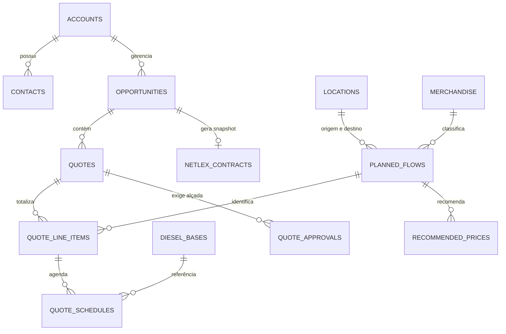

# VLI SF Playground 🚂

CRM de estudos em **português do Brasil**, com interface inspirada no Salesforce Lightning. O app usa **TanStack Start**, React 19, **Tailwind CSS 4**, **Drizzle ORM** e **Turso (libSQL/SQLite)**. As operações de banco são executadas no servidor por server functions.

> A partir de 2026-09-28, este README é o registro de retomada do projeto: cada ajuste deve atualizar o changelog abaixo e a arquitetura/regras quando elas mudarem. O item mais recente fica sempre no topo.

## Convenção para nomes de commits em lote

Todo batch que altera o produto deve usar o formato `vVERSÃO_ANTERIOR → vNOVA_VERSÃO | escopo: descrição curta`. Exemplo: `v4.18.03 → v4.18.04 | docs: padroniza nome dos batches`. Em batches com vários commits, mantenha o mesmo intervalo de versões em todos eles e use uma descrição diferente para cada commit. A versão nova também deve aparecer em `src/lib/version.ts` e no início deste changelog.

## Changelog

### v6.21.07 — Cotação: Período por padrão, edição de preços em massa e aditivo em um clique

- **Agrupar por Período primeiro**: as Agendas da Cotação agora abrem agrupadas por **Período**; **Estrutura** virou a segunda opção do seletor.
- **Edição em massa de preços** no comparativo Jetsons (barra “⚡ Edição em massa”): ajusta todas as linhas de uma vez em dois modos — **Ajustar praticado em %** (escala o preço atual, mantendo a proporção do rateio) ou **% sobre o Jetsons** (fixa um desvio alvo; 0% equivale ao preço recomendado). Tem chips rápidos, prévia ao vivo do desvio máximo estimado com a contagem de linhas acima do limite de alçada, e grava tudo de uma vez com o rateio refeito para fechar a tarifa em 100%.
- **Criar aditivo na Cotação**: a Cotação de um Contrato ganha o botão **“+ Criar aditivo”** nas ações do caminho. Ele fica desabilitado — com dica explicando o que falta — até o contrato estar em **Assinatura** no NetLex. Com um clique, cria a Oportunidade aditiva e a Cotação do aditivo já com a linha de base das Agendas vigentes, navegando direto para ela.
- **NetLex**: o status inicial do documento foi renomeado de “Aguardando retorno da NetLex” para **“Análise jurídica”** (a etapa do caminho mantém a explicação como dica). Documentos existentes são migrados automaticamente na inicialização do servidor.

### v6.20.07 — Embaralhar aditivo (shuffle com regras de data)

- **Botão “🔀 Embaralhar aditivo”** no painel Motor de aditivo da Cotação (só em Rascunho). Um clique volta a Cotação à linha de base do contrato vigente (Agendas, vigência e reajuste) e sorteia, com uma seed interna (não exibida), um cenário novo: **pelo menos 60% das Agendas são alteradas ou excluídas** (excluir ≈ 25–40% delas) e **≈ 30% de Agendas novas são incluídas**. “Agenda” = um Fluxo em um mês (todas as linhas de serviço juntas). Pede confirmação se já houver mudanças.
- **Alterar** sorteia volume, tarifa (±3–10%, com o rateio refeito para fechar a tarifa) e/ou Data Base Diesel. **Incluir** prorroga os Fluxos ativos no fim do contrato e, com 3+ Agendas novas e Fluxo elegível, inclui também um Fluxo novo.
- **Regras de data garantidas** (`src/lib/addendum-shuffle.ts`): (1) nunca repete Fluxo + mês + divisão + praça, nem de uma Agenda marcada como Excluir; (2) Agenda nova não fica antes do início da vigência nem em mês já decorrido, e depois do fim prorroga a vigência até o último dia do último mês novo (cláusula de prazo); (3) Data Base Diesel sempre `DD/MM/AAAA` com o dia de aplicação da Oportunidade, no mês da Agenda ou no anterior e igual em todas as linhas da mesma Agenda (Fluxo novo usa a data da primeira Agenda); (4) Agenda nova herda periodicidade, janela, divisão, praça, Base Diesel e tolerâncias do Fluxo; (5) meses já decorridos só são alterados/excluídos se faltarem Agendas futuras para os 60%; (6) vigência acima de 365 dias configura o reajuste anual (Diesel + IGP-M + IPCA = 100% e primeiro reajuste) quando ainda não existir.
- A validação de preços e a alçada continuam valendo: Agendas Alteradas/Incluídas com desvio acima do limite exigem aprovação.
- Verificação: build de produção aprovado; simulação de 2.100 sorteios do planejador (60%+ de mudanças, sem colisão de mês, rateio fechando 100%, datas válidas) e E2E local com vários sorteios seguidos e “Validar e concluir” passando em todas as validações estruturais (o único bloqueio foi a alçada de preço).

### v6.19.07 — Aditivo, Assinatura no NetLex e Paths estilizados

- **Aditivo implementado**: um Contrato em **Assinatura** no NetLex gera “+ Nova oportunidade de aditivo”. A Oportunidade aditiva herda partes, vigência, reajustes e tarifa; a Cotação nasce com as Agendas vigentes do contrato como **Manter**. Editar volume, preço, Base Diesel ou tolerância vira **Alterar**; “Excluir no aditivo” marca **Excluir**; Agendas novas (inclusive depois do fim original) entram como **Incluir**. Vários aditivos por contrato são permitidos; **ACS nunca gera aditivo**.
- **Motor de aditivo** (`src/lib/addendum.ts`): compara com a linha de base e gera as cláusulas (prorrogação de prazo, reajuste, inclusão, alteração, exclusão, Data Base Diesel, Take or Pay). A alçada considera só Incluir/Alterar e a Cotação exige ao menos uma mudança.
- **NetLex**: Contrato, ACS e Aditivo passam pelo NetLex. Status inicial **Aguardando retorno da NetLex** e novo status **Assinatura** (simulado pelo botão “Mover para Assinatura”). O aditivo recebe número `NNNN-A{n}`, envia só as mudanças e, na Assinatura, é aplicado ao contrato original como nova versão (histórico “Versões e aditivos”). A data de efeito é a da Assinatura.
- **Formalização clara**: regras “Formalizar no NetLex” e “Status Assinatura no NetLex” ficam vermelhas até serem cumpridas; um banner mostra o próximo passo, e Fechar só é liberado com Assinatura.
- **Paths estilizados** (`SfPath`) na Cotação (Rascunho → Validação de preços → Aprovação → Concluída → Sincronizada) e no documento NetLex (Enviado → Aguardando retorno → Assinatura).
- **Cotação**: Agendas podem ser agrupadas por **Estrutura** ou por **Período**; acordeões com seta única.
- **Agendas em lote**: o mês inicial fica dentro da vigência e o mês final é livre; ao salvar, a vigência é estendida até o último mês. No aditivo, dá para agendar depois do término original.
- Correções: a regra de duplicidade da Cotação vale só dentro da Cotação (igual ao servidor); fechar a Oportunidade após a Assinatura não esbarra mais no bloqueio de minuta enviada.
- Fora do escopo: data de efeito futura, cotação de ajuste, OV, portuário/rodoviário e integração real com o NetLex.
- Verificação: build de produção aprovado; E2E local cobriu contrato → Assinatura → fechamento → aditivo (Manter/Alterar/Excluir/Incluir após o fim) → validação/sincronização → envio 18001-A1 → Assinatura → contrato original atualizado (versão 2) → segundo aditivo partindo do contrato atualizado.

### v5.19.07 — Aprovação simplificada e etapa de contrato NetLex

- Amplia o Comparativo Jetsons para até 1280px; remove nomes e níveis de aprovadores e deixa apenas os perfis **Vendas** e **Aprovador**.
- Uma Cotação com preço aprovado agora passa na validação da Oportunidade. A etapa Formalização exige cotação sincronizada, preço resolvido e nenhuma aprovação pendente.
- Adiciona **Enviar contrato ao NetLex** na Oportunidade, animação de envio, número de contrato destacado e página de minuta em nova aba.
- A minuta simulada reúne as partes, a vigência, o preço aprovado, tarifas e agendas, reajustes e tolerâncias de Take or Pay. Valida os dados da jornada e congela as condições após o envio.
- O status fica em **Aguardando retorno da NetLex**. Nenhum arquivo é enviado a um NetLex real; campos jurídicos complementares e evolução de status permanecem fora desta simulação.
- Verificação: build de produção aprovado; E2E local confirmou aprovação → Formalização → envio, número, abertura em nova aba e dados da minuta.

### v5.19.06 — Preços Jetsons por Agenda e avisos fecháveis

- **Preço Jetsons de mercado**: recomendações determinísticas por mercadoria, trecho, serviço e período são geradas automaticamente na Cotação e exibidas ao lado do preço praticado.
- **Comparativo e alçada por Agenda**: a tela agrupa Companhia → Mercadoria → Trecho → Modal → Serviço, lista todas as Agendas e permite editar cada preço. Verde até 5%, amarelo acima de 5% até 7%, vermelho acima de 7%. A pior Agenda individual governa a Cotação — descontos fortes não são mais diluídos pela média do Item.
- **Ações de preço**: aplicação do recomendado em todas as Agendas, revalidação com feedback e envio para a fila de Aprovação. O status do cabeçalho atualiza após uma edição.
- **Cotações alternativas**: uma nova Cotação pode reutilizar o mesmo período e praça do Fluxo em outra Cotação da Oportunidade; a chave da Agenda vale dentro de cada Cotação.
- **Avisos fecháveis**: notificações toast exibem um X acessível para dispensá-las.
- Verificação: build de produção aprovado; E2E passou em 24/24 verificações, incluindo edição, limites de alçada, envio à fila e fechamento do aviso.

### v5.19.05 — Correções de UX: vigência configurável, header responsivo, aba Aprovação e ACS

- **Vigência configurável onde é exigida**: a Cotação agora mostra a vigência da Oportunidade com edição inline (alerta "Definir vigência" quando ausente), e o screenflow do Item exibe um banner com os campos de início/fim quando a Oportunidade não tem vigência — salvar e continuar no mesmo fluxo, sem sair da tela. Valida início antes do fim e ACS inferior a 12 meses.
- **Header responsivo**: o cabeçalho global mantém uma única linha em todas as larguras; a busca some em ≤1200px e o badge do aprovador logado some em ≤900px, sem quebrar o layout.
- **Aba Aprovação exclusiva de aprovadores**: a aba só aparece na navegação quando há aprovador logado em Configurações.
- **Aprovadores chumbados no sistema**: Marina Duarte (Diretoria), Ricardo Nunes e Fernanda Lopes (Gerente Geral) são recriados automaticamente no boot do servidor — sempre é possível assumir a visão de um aprovador.
- **ACS sem reajuste**: no SF real o ACS não tem reajuste; o screenflow pula a etapa Reajuste Ferro para ACS (3 etapas: Fluxo → Agendas → Revisão) e a mantém para Contrato (4 etapas). O stepper reflete as etapas de cada instrumento.
- `listQuoteOptions` passa a expor o `id` da Oportunidade, habilitando o quick fix de vigência a partir da Cotação.
- Verificação: build de produção aprovado e E2E cobrindo quick fix de vigência, banner do screenflow, Contrato × ACS, re-seed de aprovadores e o caminho feliz de preços/concluir/sincronizar.

### v5.19.04 — Margem/Alçada: validação de preço e fluxo de aprovação

- Adiciona **Validar preços** na Cotação: compara o preço praticado de cada Item (fluxo × serviço) com o **preço recomendado (Jetsons mock)** por período e mostra o comparativo com desvio em R$ e %, veredito da Cotação e situação por Item.
- O **maior desvio entre os Itens governa a Cotação inteira**: até o limite de Gerente Geral dispensa aprovação; acima exige **Gerente Geral**; acima do limite da Diretoria exige **Diretoria**. Os limiares ficam em **Configurações** (padrão 5% e 7%).
- Concluir a Cotação agora valida os preços no servidor: item sem preço no Jetsons bloqueia com ação para gerar os preços ausentes (Faker com a seed da Cotação); desvio acima do limite cria a solicitação de alçada automaticamente e bloqueia a conclusão. Sincronizar exige preço ok ou aprovado.
- Opções de resolução quando o preço não está ok: **Aplicar preço recomendado** (reescreve as tarifas de todos os grupos mantendo o rateio em 100%), **Gerar preços recomendados ausentes** e **Enviar para aprovação**.
- Nova aba **Aprovação** (segunda aba, depois de Início) com a fila de solicitações pendentes, aprovação/rejeição com comentário e histórico de decisões, no padrão de processo de aprovação do Salesforce.
- **Configurações** ganha login como aprovador (Diretoria aprova qualquer alçada; Gerente Geral só alçadas de Gerente Geral) e edição dos limiares de alçada. O aprovador logado aparece no cabeçalho.
- Novos objetos: **Aprovadores**, **Preços Recomendados** (Jetsons mock por fluxo, serviço e período) e **Aprovações de Cotação**, com listas, rotas de registro e geradores Faker. O gerador de Cotação passa a criar os preços recomendados dos itens gerados.
- Checklists de regras da Cotação ganham **Preço validado contra o recomendado** e **Alçada aprovada quando exigida**, com tooltips explicando critério, efeito e como atender; a página de Aprovação tem seu próprio quadro de regras.
- O Início mostra a contagem de aprovações pendentes; editar itens ou agendas marca o preço como desatualizado e cancela aprovações obsoletas.
- Verificação: build de produção aprovado e E2E executando todo o fluxo (validação, bloqueio, permissões por nível, rejeição, aplicação do recomendado, aprovação, conclusão e sincronização).

### v4.18.04 — Convenção de nomes para commits em lote

- Define o prefixo obrigatório com versão anterior e nova versão para os títulos dos commits de cada batch.
- Orienta manter o mesmo intervalo de versões em todos os commits do batch e diferenciar cada título pela descrição da alteração.

### v4.18.03 — Corrige a versão exibida no preview

- Incrementa a versão mostrada ao lado de CRM para confirmar a atualização implantada no Vercel.
- Verificação: conferir o status do novo deployment e a versão do artefato publicado.

### v4.17.03 — Faixa de valores do pipeline e responsividade global

- Limita valores monetários individuais gerados para Oportunidades e Contas a R$ 100–R$ 9.999; atualiza também os valores do factory reset. Totais e consolidados continuam sendo somas sem teto.
- Adiciona base responsiva compartilhada para telas retrato/paisagem, tablets e celulares: navegação rolável, grades flexíveis, cabeçalhos e ações adaptáveis, tabelas com rolagem própria e modais ajustados à viewport.
- Verificação: build de produção e revisão em larguras estreitas e orientação paisagem.

### v4.16.03 — Etapa Reajuste Ferro no screenflow da Cotação

- Insere **Reajuste Ferro** entre a seleção do Fluxo e a montagem das Agendas, exibindo percentuais, vigência, dia de aplicação e data do primeiro reajuste configurados na Oportunidade.
- Para vigências acima de 365 dias, exige percentuais de Diesel + IGP-M + IPCA somando 100% e data do primeiro reajuste dentro da vigência; a regra é verificada na tela, no checklist da Oportunidade e no servidor ao salvar.
- Identifica a Base Diesel e a Data Base Diesel em cada grupo de Agenda/Fluxo, com o dia de aplicação herdado da Oportunidade.
- Mantém o cálculo financeiro de reajuste como gap técnico registrado; a geração da cláusula NetLex segue fora desta etapa.
- Verificação: build de produção aprovado.

### v4.15.03 — Criação de Agendas em lote por intervalo

- Adiciona **Criar em lote** aos grupos de Agenda do screenflow, com seleção de mês inicial e final dentro da vigência da Oportunidade.
- Cria um grupo para cada mês disponível, copiando os dados do grupo de referência e montando automaticamente a Data Base Diesel com o dia de aplicação da Oportunidade.
- Ignora chaves de Agenda já usadas na Cotação ou existentes no formulário e informa a quantidade criada e os meses ignorados.
- Verificação: build de produção aprovado.

### v4.14.03 — Explicações reutilizáveis das regras de negócio

- O checklist compartilhado de regras aceita explicações por regra, título e descrição, para que novas páginas e etapas reutilizem o mesmo comportamento.
- Cada regra de Oportunidade e Cotação oferece tooltip detalhado com mouse e teclado; o conteúdo explica o critério, seu efeito e como atendê-lo.
- O posicionamento se adapta a telas menores e às últimas linhas do painel, e os controles têm rótulos acessíveis.
- Verificação: build de produção aprovado.

### v4.13.03 — Acompanhamento das regras de negócio

- Troca as orientações estáticas na Oportunidade por um checklist calculado com a Conta, o instrumento, o segmento, a vigência, o dia de aplicação, a etapa e o estado da Cotação.
- Adiciona ao lado da Cotação um checklist calculado dos Itens e Agendas: Conta do Fluxo, origem FLOU, dimensões completas, volume e tarifa, FRETE, Base Diesel e data, rateio, duplicidade e regras de ACS.
- Cada regra pendente aparece em vermelho e cada regra atendida em verde; o painel recalcula após salvar, editar, excluir, concluir ou sincronizar registros.
- Verificação: build de produção aprovado.

### v4.12.03 — Regras de geração e entrada da Cotação

- Contas criadas pelo Faker passam a ser sempre Contas de gestão (`Cliente - Direto`).
- O Faker de Oportunidade gera somente o escopo ferroviário atual: Contrato com vigência de 1 a 5 anos ou ACS com vigência de 1 a 11 meses, ambos iniciando hoje; escolhe e salva automaticamente o dia de aplicação 1, 10 ou 20.
- O screenflow mostra a escolha CBS ou tarifa líquida na etapa de Agendas; a escolha vale para toda a Cotação e fica travada após a primeira Agenda.
- O dia de aplicação da Oportunidade substitui o dia informado na Data Base Diesel, que fica visível como data automática no screenflow.
- Ao abrir as opções de Fluxo da Cotação, o servidor garante um catálogo ferroviário elegível vinculado à Conta e apresenta somente esses Fluxos, sem expor o sistema de origem na jornada.
- Migração automática adiciona os campos novos às bases existentes; regras de tolerância e aditivo seguem fora deste incremento.
- Verificação: build de produção aprovado. O lint geral aponta falhas de formatação preexistentes em vários arquivos do repositório; não foi usado para reformatar arquivos inteiros fora do escopo.

### v3.12.03 — Avanço do Path após sincronização

- Corrige o Path da Oportunidade, que mantinha **Marcar etapa como concluída** desabilitado em Negociação mesmo com uma Cotação sincronizada.
- Agora Negociação → Aprovação é liberado quando existe Cotação com status **Sincronizada**; sem ela, o bloqueio explica o que falta. A validação do servidor continua sendo a autoridade.
- Atualiza a lista relacionada após sincronizar para refletir o estado novo sem recarregar manualmente.
- Revisão de regressão de ponta a ponta em produção: corrigir a Agenda de teste que tinha rateio 0%; concluir e sincronizar a Cotação; avançar o Path de Negociação para Aprovação. O endpoint atual do fluxo foi confirmado. Formalização, decisão de alçada e NetLex seguem pendentes.

### v3.11.03 — Screenflow de Item e Agenda

- Ao adicionar um Item novo ou Agenda a um Item existente, abre um screenflow de três etapas: Fluxo do Cliente, Agendas e Revisão.
- Guia Cliente → Origem → Destino → Mercadoria → Modal; o Cliente é fixado pela Conta de gestão da Oportunidade.
- Permite adicionar múltiplos períodos e serviços no mesmo grupo, exige FRETE e ajuda a ratear tarifas/percentuais até 100%; inclui Faker com seed explícita.
- Ao adicionar Agendas a um Item existente, mantém o Cliente e o Fluxo fixos; o Faker procura o próximo período ainda sem chave usada. Edição do serviço principal do Item continua disponível.
- Grava novo Item e todas as Agendas em uma transação única. Se qualquer regra falhar, nada desse envio fica parcialmente salvo e a Cotação mostra toast com a causa.
- Valida no servidor etapa/segmento/instrumento da Oportunidade, titularidade ferroviária FLOU do Fluxo, vigência (ACS < 12 meses), período dentro da vigência, volume inteiro, tarifa CBS ou líquida, Base Diesel, periodicidade/janela, FRETE, rateio e duplicidade.
- Revisão de regressão: build de produção e lint sem erros; em produção, conferir abertura do assistente para Novo Item e Adicionar Agenda, Cliente e Fluxo travados no Item existente, cascata, seed repetível, múltiplos grupos e rateio CARGA/FRETE 50/50. O salvamento conjunto/rollback foi validado pelo caminho compilado e pelas regras no servidor; smoke test de gravação do screenflow em registro novo ainda pendente.

### v3.10.03 — Fluxo de Cotação ponta a ponta

- Troca o seletor plano do Item por uma montagem em cascata: Cliente → Origem → Destino → Mercadoria → Modal; cada Item representa uma combinação e “Salvar e adicionar outro” agiliza múltiplas ramificações.
- Corrige o Faker da Agenda: conserva o serviço escolhido no Item, mantém CBS ou tarifa líquida conforme a Oportunidade e gera rateio inicial de 100% que fecha a tarifa.
- Gera períodos dentro da vigência, procura uma chave livre para o serviço e valida a vigência no servidor já ao salvar, com toast claro se a regra impedir o registro.
- Mostra erros e sucessos em toast ao concluir/sincronizar a Cotação e documenta o caminho completo, seu ponto de encerramento atual e os módulos ainda pendentes.
- Revisão de regressão: testar inclusão individual de Quote, cascata e vínculo ao Cliente, salvar Agenda seedada, concluir e sincronizar, atualizar a Oportunidade e checar o bloqueio para Formalização sem Aprovação.

### v3.09.03 — Corrigir criação de Cotações e regressão antes do deploy

- Nova Cotação e Criar em lote agora explicam por toast que a oportunidade precisa estar em Negociação; em Prospecção, a ação “Avançar e continuar” muda a etapa e abre o formulário escolhido.
- Erros do servidor ao salvar registros individuais ou em lote são apresentados por toast e continuam visíveis no formulário.
- Adota uma revisão de regressão antes de cada publicação: conferir o recurso alterado, as regras no servidor e os fluxos adjacentes de leitura, criação, edição e exclusão; para Cotações, conferir aba, Path, vínculo à Oportunidade e criação individual/em lote, incluindo o avanço de etapa.
- Conferência desta publicação: build de produção, revisão do avanço Prospecção → Negociação e do bloqueio para outras etapas. O smoke test com registros reais do banco de produção depende da sessão do app.

### v3.08.03 — Toast para erros ao salvar Cotações

- Adiciona um toaster global no app e mostra notificações toast quando o salvamento individual ou em lote falha.
- Erros de regra de negócio, como criar Cotação fora da etapa Negociação, aparecem em destaque sem perder a mensagem detalhada no formulário.

### v3.07.03 — Aba de Cotações na Oportunidade

- Adiciona a aba **Cotações** antes de **Detalhes** nas Oportunidades ferroviárias de Contrato/ACS.
- Exibe a lista completa de cotações vinculadas, com abertura do registro, criação, edição e exclusão individual ou em lote.
- Mantém **Detalhes** e o conteúdo existente da Oportunidade na aba seguinte.

### v3.06.03 — Cotação ferroviária com Contrato e ACS

- Adiciona Cotação, Item da Cotação e Agenda como registros persistidos, com listas e rotas próprias.
- Implementa a montagem manual em hierarquia expansível: Cotação → Itens agrupados por Fluxo Planejado e Serviço → Agendas por período.
- Permite criar, editar e excluir itens/agendas dentro da Cotação, além de CRUD individual e em lote nas listas de objetos.
- Adiciona o pacote “Gerar Cotação + itens + agendas”, com seed explícita, dados Faker persistidos e referências vinculadas à mesma Conta e Oportunidade.
- Cria cadastros mockados de Fluxo Planejado, Location, Mercadoria e Base Diesel; exibe rotas pelas siglas oficiais guardadas nos Locations.
- Adiciona lista relacionada de Cotações à Oportunidade ferroviária de Contrato/ACS.
- Reproduz validações do escopo ferroviário: conta do fluxo, origem FLOU, chave da agenda, volume inteiro, tarifa CBS ou líquida conforme Oportunidade, FRETE, rateio de acessórios, Base Diesel, datas, vigência e ACS sem Take or Pay.
- Implementa os estados Rascunho → Concluída → Sincronizada; a Oportunidade só avança para Aprovação após sincronizar uma Cotação.
- Escopo desta versão: somente Ferroviário, Contrato e ACS. Dados de preço são mockados por seed; Jetsons, alçadas, Porto, Rodoviário, Aditivo, upload CSV e integração real com Salesforce ainda não estão implementados.

### v2.06.03 — Edição pelos campos principais do Path

- Torna o link **Editar** do painel de campos principais do Path funcional; ele abre a edição da oportunidade.

### v2.05.03 — Path e regras de etapa da Oportunidade

- Adiciona Path estilo Salesforce na página individual da oportunidade, logo abaixo do cabeçalho do registro.
- Exibe as etapas Prospecção → Negociação → Aprovação → Formalização → Fechado, campos principais e orientações contextuais.
- Permite concluir Prospecção e avançar para Negociação. A validação no servidor também protege alterações individuais e em lote.
- Bloqueia avanço para Aprovação sem Cotação concluída e sincronizada, para Formalização sem aprovação registrada e para Fechado sem integração NetLex. Esses módulos ainda não existem no playground.
- O Faker de oportunidades começa em Prospecção para respeitar o fluxo implementado.
- Passa a documentar neste README alterações, arquitetura, relacionamentos e regras como registro contínuo do projeto.

### v2.04.03 — Página própria de Oportunidade

- Adiciona a rota de detalhe da oportunidade; clicar no registro abre sua página individual.
- Disponibiliza os dados completos da oportunidade, edição e exclusão, com link para a Conta de gestão.
- Mantém acesso à página a partir da lista de oportunidades e da lista relacionada na Conta.

### v2.03.03 — Objeto Oportunidade

- Adiciona o objeto Oportunidade ligado obrigatoriamente a uma Conta de gestão.
- Inclui instrumento, estágio, segmento, valor, datas previstas e de vigência, percentuais de reajuste, partes contratuais, tarifa de integração e Take or Pay.
- Inclui CRUD individual e em lote, lista relacionada à Conta e total do valor das oportunidades no detalhe da Conta.
- Registra um gerador Faker com seed determinística. O gerador fica pronto para uso; não cria registros automaticamente.

### v2.02.03 — Configurações e personalização de listas

- Adiciona Configurações com opção de apagar os dados do playground e opção de restauração de fábrica dos dados de demonstração.
- Adiciona configuração por objeto para reordenar colunas e escolher quais colunas aparecem.

### v1.02.03 — Identificação de versão

- Exibe a versão atual junto ao nome CRM.
- Define a política de versionamento em [VERSIONING.md](VERSIONING.md).

### Base anterior ao versionamento — Contas, Contatos e listas relacionadas

- Adiciona CRUD individual e em lote, incluindo exclusão individual e em lote, para Contas e Contatos.
- Adiciona páginas próprias para os registros de Conta e Contato.
- Adiciona listas relacionadas configuráveis com criação individual/em lote, vínculo automático ao registro pai, reordenação, remoção e visualização em tela cheia.
- Adiciona geradores Faker em português com seed determinística.
- Estabelece componentes compartilhados para listas, formulários, exclusão e listas relacionadas.

## Objetos e arquitetura

A arquitetura segue o padrão de objetos reutilizáveis do playground. Cada objeto tem sua tabela persistida, lista de registros, rota de detalhe, formulários CRUD e gerador Faker. As relações usam chaves estrangeiras e as listas relacionadas reaproveitam os componentes comuns.



| Objeto          | Tabela             | Relacionamento                                                                                | Página de lista     | Página do registro      |
| --------------- | ------------------ | --------------------------------------------------------------------------------------------- | ------------------- | ----------------------- |
| Conta           | `accounts`         | Registro pai de Contatos e Oportunidades                                                      | `/accounts`         | `/accounts/$id`         |
| Contato         | `contacts`         | `account_id` obrigatório → Conta                                                              | `/contacts`         | `/contacts/$id`         |
| Oportunidade    | `opportunities`    | `account_id` obrigatório → Conta de gestão                                                    | `/opportunities`    | `/opportunities/$id`    |
| Fluxo Planejado | `planned_flows`    | Conta + Location de origem + Location de destino + Mercadoria; modal Ferroviário; origem FLOU | `/planned-flows`    | `/planned-flows/$id`    |
| Location        | `locations`        | Dimensão geográfica usada como origem ou destino                                              | `/locations`        | `/locations/$id`        |
| Mercadoria      | `merchandise`      | Dimensão de produto e unidade do fluxo                                                        | `/merchandise`      | `/merchandise/$id`      |
| Base Diesel     | `diesel_bases`     | Referência exigida em cada Agenda ferroviária                                                 | `/diesel-bases`     | `/diesel-bases/$id`     |
| Cotação         | `quotes`           | `opportunity_id` obrigatório → Oportunidade                                                   | `/quotes`           | `/quotes/$id`           |
| Item da Cotação | `quote_line_items` | Cotação + Fluxo Planejado + Serviço                                                           | `/quote-line-items` | `/quote-line-items/$id` |
| Agenda          | `quote_schedules`  | Item + período + tarifa + diesel + serviço e rateio                                           | `/quote-schedules`  | `/quote-schedules/$id`  |
| Contrato NetLex | `netlex_contracts` | Snapshot único por Oportunidade; número, status inicial e dados comerciais                    | —                   | `/netlex/contracts/$id` |
| Aprovadores (legado) | `approvers`   | Tabela antiga não usada pelo fluxo simulado atual                                              | `/approvers`        | `/approvers/$id`        |
| Preço Recomendado | `recommended_prices` | Fluxo Planejado + serviço + período; referência do Jetsons (mock) na validação de preço   | `/recommended-prices` | `/recommended-prices/$id` |
| Aprovação       | `quote_approvals`  | Cotação com desvio acima do limite; decidida por um Aprovador logado                           | `/approvals`        | `/approvals/$id`        |

### Relações e efeitos

- Uma Conta pode ter muitos Contatos e muitas Oportunidades.
- Contato e Oportunidade pertencem a uma Conta por `account_id`; a exclusão da Conta remove seus registros dependentes.
- A lista relacionada respeita o registro pai: ao criar um contato ou oportunidade dentro de uma Conta, o vínculo àquela Conta é aplicado automaticamente.
- A página da Conta agrega o valor das Oportunidades vinculadas. Esse total é uma soma calculada e não substitui o campo próprio `lifetime_value` da Conta.
- O catálogo ferroviário é mockado no banco do playground. Uma Conta recebe Fluxos Planejados vinculados quando o pacote de cotação é gerado. A mesma seed produz códigos, número de Cotação, serviços, volumes, tarifas e rateios reproduzíveis.
- A rota visível do fluxo usa `Location.code` para origem e destino, por exemplo `PPN → QPM`. O registro do Fluxo mantém as referências às cinco dimensões: Conta, origem, destino, Mercadoria e modal; a sigla da rota sozinha não identifica um fluxo.
- Uma Cotação pertence a uma Oportunidade em Negociação. Ela pode conter vários Itens; cada Item representa uma combinação de fluxo e serviço; as Agendas guardam as linhas de período. Cada página tem sua própria rota, e a tela da Cotação permite expandir/recolher itens e agendas com chevrons.
- Depois que uma Cotação aprovada é sincronizada e a Oportunidade chega à Formalização, o usuário pode gerar um snapshot de Contrato NetLex simulado. Cada Oportunidade pode gerar apenas um contrato nesta etapa.
- A Cotação pode ser montada manualmente ou pelo gerador com seed. O gerador cria três fluxos da Conta, um Item por serviço e agendas mensais para cada grupo, incluindo FRETE e dois ou três serviços acessórios.
- O catálogo usa siglas de Location, mercadorias e Base Diesel ELDORADO documentadas. Esses cadastros e as tarifas são dados fictícios do playground, não registros consultados em Salesforce.
- Uma Oportunidade aponta para a Conta de gestão, que representa o nível superior. Contas granulares e demais partes contratuais ainda não têm objeto/relacionamento próprio no playground.

### Campos da Oportunidade

| Grupo       | Campos                                                                                                                                 |
| ----------- | -------------------------------------------------------------------------------------------------------------------------------------- |
| Contexto    | Conta de gestão                                                                                                                        |
| Comercial   | Tipo de instrumento (Contrato, ACS, Aditivo, Outros Serviços), segmento, estágio, valor e data prevista de fechamento                  |
| Jurídico    | Vigência inicial/final, reajustes Diesel/IGP-M/IPCA, contratante(s), entidade VLI contratada, devedor solidário e tarifa de integração |
| Compromisso | Take or Pay                                                                                                                            |

### Path e validações atuais

Etapas apresentadas no registro: **Prospecção → Negociação → Aprovação → Formalização → Fechado**.

- Toda oportunidade nova começa em **Prospecção**.
- O Path permite avançar de **Prospecção** para **Negociação**.
- A alteração de estágio é validada no servidor para CRUD individual e em lote; não depende apenas do botão ou da interface.
- De **Negociação** para **Aprovação**, o servidor exige que uma Cotação seja concluída e sincronizada, com preços validados (ok ou aprovados por alçada).
- De **Aprovação** para **Formalização**, exige Cotação sincronizada, preço `Ok` ou `Aprovada`, aprovação registrada quando necessária e nenhuma solicitação pendente.
- Em **Formalização**, um Contrato pode ser enviado ao NetLex simulado quando as partes, vigência, Cotação e regras contratuais estiverem válidas.
- De **Formalização** para **Fechado**, ainda exige retorno jurídico e contrato vigente, que não fazem parte desta etapa; o Path permanece bloqueado.
- A transição de **Aprovação** para **Negociação** é permitida para representar rejeição ou cancelamento de aprovação.
- A edição de outros campos da oportunidade não exige mudança de estágio.

### Contrato simulado no NetLex

- A ação aparece na Oportunidade do tipo **Contrato**, em **Formalização**, após a aprovação de preços e a sincronização da Cotação. O servidor também revalida os pré-requisitos antes de criar o snapshot.
- O envio simulado valida partes cliente/VLI, vigência, agendas dentro da vigência, reajustes (quando a vigência excede 365 dias), estado de aprovação, tolerâncias e itens da Cotação.
- O registro guarda Contratante(s), entidade VLI, devedor solidário opcional, vigência, regra de tarifa, reajustes, indicação de Take or Pay, trechos, serviços, períodos, volumes e tarifas aprovadas. A minuta distingue a tarifa total do grupo da parcela rateada para cada serviço.
- O número NetLex e o status **Aguardando retorno da NetLex** ficam destacados na Oportunidade. O link abre a minuta em nova aba.
- O documento é um snapshot demonstrativo, não tem validade jurídica e não chama a API externa. O fluxo real completa outros dados e questionários no NetLex; cancelamento/reenvio e retorno de status ainda não estão simulados. Após o envio, os dados que compõem a minuta ficam protegidos contra edição/exclusão.

### Cotação ferroviária: Contrato e ACS

- A lista relacionada de Cotações aparece na Oportunidade ferroviária de Contrato/ACS. Uma nova Cotação exige a Oportunidade em Negociação.
- Status da Cotação: **Rascunho → Concluída → Sincronizada**. Há no máximo uma Cotação sincronizada por Oportunidade. Concluir valida toda a hierarquia; sincronizar replica o estado para a Oportunidade.
- Preço e alçada: o botão **Validar preços** compara cada Agenda com o preço recomendado (Jetsons mock). A maior diferença governa a Cotação. Até 5% não exige aprovação; acima de 5% envia à fila do **Perfil Aprovador**; acima de 7% também recebe gravidade visual alta. Não há níveis nem nomes de aprovadores. Editar Itens ou Agendas invalida a aprovação anterior; Concluir e Sincronizar exigem preço `Ok` ou `Aprovada`.
- Record Type usado no escopo atual: `VLI_General`. Tipos de Quote diferentes de Contrato/ACS não são oferecidos nesta entrega.
- Um Fluxo Planejado elegível pertence à Conta da Oportunidade e é ferroviário. O catálogo cria os registros internos de origem necessários quando a conta ainda não tem Fluxo elegível; essa origem não aparece na jornada. Location e Mercadoria são referências ligadas ao registro do fluxo. A interface monta a rota a partir das siglas cadastradas.
- Cada agenda deve ter ano entre 1900 e 4000, mês de 1 a 12, volume inteiro positivo, Base Diesel e serviço ferroviário permitido. Na etapa de Agendas, a pessoa escolhe CBS ou líquida para a Cotação; uma vez salva a primeira Agenda, essa escolha fica fixa. Não são aceitas duas tarifas positivas.
- Serviços permitidos: FRETE, CARGA, DESCARGA, BALDEAÇÃO, MANOBRA ORIGEM e MANOBRA DESTINO. Cada grupo de Fluxo/período/divisão/praça precisa conter FRETE; o rateio de acessórios deve fechar o valor principal com diferença máxima de R$ 0,02 e somar 100% com tolerância de 0,2 ponto percentual.
- `VLI_KeySchedule__c` é representada localmente como `schedule_key`: código do fluxo + AAAAMM + divisão + praça. A agenda repetida para outro serviço pode compartilhar a chave; o mesmo serviço na mesma chave é rejeitado inclusive entre cotações.
- DataBaseDiesel aceita `MM/AAAA` ou `DD/MM/AAAA`; é exigida para periodicidade anual ou quando o fluxo tem agendas em meses diferentes. O dia efetivo é sempre substituído pelo dia de aplicação 1, 10 ou 20 salvo na Oportunidade. Um fluxo mantém uma Base Diesel por Cotação. O catálogo mock inicial inclui ELDORADO.
- Vigência inicial/final da Oportunidade deve cobrir as agendas. ACS exige vigência inferior a 12 meses e rejeita qualquer tolerância positiva; assim, ACS não cria Take or Pay. Em Contrato, as quatro tolerâncias, quando usadas, devem ser inteiras de 0 a 100 e preenchidas em conjunto.
- Dados Faker são mockados e reproduzíveis por seed. O gerador não consulta Jetsons, não calcula recomendação real de preço e não representa sincronização com Salesforce.

As regras de negócio já simuladas para Cotação, Aprovação e criação do snapshot de Contrato NetLex estão descritas nesta página. Questionário jurídico, envio real, assinatura e retorno de status continuam pendentes; não devem ser descritos como validações ativas.

#### Regras em níveis

**Ferroviário · Contrato e ACS**

- **Cliente**
  - É sempre a Conta de gestão da Oportunidade.
  - **Origem**
    - **Destino**
      - **Mercadoria**
        - **Modal**: Ferroviário neste escopo.
  - Cada nível pode ter várias opções/ramificações. Cada Item persistido aponta para a combinação completa do Fluxo Planejado.
- **Item e Agenda**
  - Volume inteiro e positivo; preencher CBS ou tarifa líquida conforme a Oportunidade.
  - Cada grupo precisa de FRETE, Base Diesel e valores/percentuais de rateio consistentes; o valor fecha a tarifa e os percentuais somam 100%.
  - A chave de duplicidade usa fluxo, período, divisão e praça; o mesmo serviço não pode repetir, inclusive em outras Cotações.
- **ACS**
  - Vigência menor que 12 meses; tolerâncias e Take or Pay zerados.
- **Preço e Alçada**
  - Cada Item é comparado ao preço recomendado (Jetsons mock) por fluxo, serviço e período; o desvio percentual é o desconto praticado em relação ao recomendado.
  - A maior diferença entre as Agendas governa a Cotação: até o limite configurado (padrão 5%) não exige aprovação; acima entra na fila. O limite alto (padrão 7%) é somente uma indicação visual de gravidade.
  - Item sem preço no Jetsons bloqueia a validação; é possível gerar os preços ausentes com a seed da Cotação ou aplicar o preço recomendado em todos os grupos (rateio recalculado em 100%).
  - A solicitação vai para a fila da aba Aprovação; somente o **Perfil Aprovador** decide. O Perfil Vendas prepara as Cotações. Não existem aprovadores individuais ou níveis hierárquicos nesta simulação.
- **Avanço**
  - Concluir e sincronizar a Cotação habilita a Oportunidade para Aprovação.

### Tutorial: da Conta ao ponto final disponível

1. **Criar ou escolher a Conta de gestão**
   - Abra **Contas** e escolha **Nova** (ou abra uma Conta existente).
   - Salve os dados da Conta. Os Fluxos Planejados são vinculados a essa Conta.
2. **Criar a Oportunidade**
   - Na Conta, em **Listas relacionadas → Oportunidades**, escolha **Novo**; ou use a lista **Oportunidades**.
   - Selecione a Conta de gestão, tipo **Contrato** ou **ACS**, segmento **Ferroviário**, tarifa **CBS** ou **Líquida**, vigência e partes contratuais.
   - Salve. A Oportunidade começa em **Prospecção**.
3. **Avançar para Negociação**
   - Abra a página da Oportunidade e clique **Nova Cotação** ou **Criar em lote**.
   - O toast explica o requisito. Em Prospecção, escolha **Avançar e continuar**; a etapa muda para **Negociação** e o formulário abre.
4. **Criar uma Cotação**
   - Na aba **Cotações**, crie uma Cotação individual; ou abra **Cotações** e use **Nova Cotação manual**.
   - Ela fica vinculada à Oportunidade e inicia em **Rascunho**. Para montar toda a massa com seed, use **Gerar Cotação + itens + agendas** na lista Cotações e selecione a Oportunidade.
5. **Montar Item e Agendas no screenflow**
   - Dentro da Cotação, escolha **Adicionar Item**. O assistente abre em três etapas: Fluxo do Cliente → Agendas → Revisão.
   - Selecione Cliente → Origem → Destino → Mercadoria → Modal, nessa ordem. O Cliente vem fixo da Conta de gestão; cada seleção filtra as opções válidas seguintes.
   - Na etapa **Agendas**, escolha o serviço principal do Item, informe uma seed do Faker e adicione quantos grupos de período precisar.
   - Em cada grupo, confira período dentro da vigência, divisão, praça, volume inteiro, tarifa conforme CBS/Líquida, Base Diesel e data base. Inclua serviços; FRETE é obrigatório e o rateio deve fechar tarifa e 100%.
   - Use **Adicionar período** para incluir uma Agenda manualmente. **Criar em lote** gera um grupo por mês no intervalo escolhido, dentro da vigência, copiando os dados do grupo selecionado; períodos já usados são ignorados. **Gerar com Faker** continua disponível para preencher um grupo com dados repetíveis da seed.
   - Na etapa **Revisão**, confira o resumo e escolha **Salvar Item e Agendas**. O sistema grava tudo em uma transação; se alguma regra falhar, o toast explica o motivo e não deixa um Item incompleto.
   - Para acrescentar agendas a um Item já existente, expanda-o e escolha **Adicionar Agenda**: o mesmo screenflow abre com o Fluxo fixado e associa os grupos ao Item.
6. **Validar preços e concluir**
   - Clique **Validar preços**. O painel compara cada Agenda com o preço recomendado (Jetsons mock) e mostra o veredito, o maior desvio e a situação visual.
   - Se algum Item estiver sem preço recomendado, use **Gerar preços recomendados ausentes** (Faker com a seed da Cotação). Se o desvio passar do limite, aplique o **Aplicar preço recomendado** ou **Enviar para aprovação**.
   - Clique **Validar e concluir**. Se houver regra pendente, o toast identifica o problema; corrija os dados e tente novamente. Desvio acima do limite envia a Cotação para a fila de Aprovação automaticamente.
7. **Decidir aprovação (se exigida)**
   - Em **Configurações**, alterne para **Perfil Aprovador**.
   - Abra a aba **Aprovação**, revise a Cotação e o desvio, e decida **Aprovar** ou **Rejeitar**. Aprovar libera a Cotação para seguir; rejeitar mantém os preços bloqueados até ajuste e revalidação.
   - Após concluir, clique **Sincronizar com Oportunidade**. O status passa para **Sincronizada**.
8. **Criar o Contrato NetLex simulado**
   - Volte à Oportunidade. Com a Cotação sincronizada e preços resolvidos, o Path permite avançar de **Negociação → Aprovação → Formalização**.
   - Preencha **Contratante(s)** e **Entidade VLI** se ainda estiverem vazias e clique **Enviar contrato ao NetLex**.
   - A modal mostra o envio simulado. Depois, o número e status inicial aparecem em destaque; clique no link para abrir a minuta em nova aba.
   - **A jornada termina em “Aguardando retorno da NetLex”.** Envio real, questionário jurídico, assinatura, retorno de status e fechamento ainda não existem no Playground.

Ao registrar novas regras ou corrigir o fluxo, manter a hierarquia de bullets e subtópicos e indicar o que está ativo, o que está pendente e em que etapa aparece cada validação.

## Funcionalidades existentes

- CRUD individual nos objetos do CRM.
- CRUD em lote, incluindo criar, atualizar e excluir registros selecionados (até 500 registros por chamada de servidor).
- Validação de preço por Agenda contra o preço recomendado (Jetsons mock), com comparação, edição e preço recomendado; aprovação simplificada por perfil Vendas/Aprovador, sem nomes nem hierarquia.
- Criação de contrato simulado a partir da Oportunidade formalizada, com snapshot dos dados comerciais aprovados e página de minuta em nova aba.
- Listas relacionadas configuráveis; no detalhe da Conta, Contatos e Oportunidades mostram as primeiras três colunas e suportam operações individuais/em lote.
- Criação em lote numa lista relacionada mantém todos os registros vinculados ao respectivo registro pai.
- Abertura das listas relacionadas em tela cheia, reordenação e remoção da configuração da lista.
- Preferências de visibilidade e ordem das colunas por objeto.
- Configurações globais para limpar dados e restaurar dados de demonstração.
- Faker pt-BR por objeto, com seed determinística; gerar é uma ação explícita do usuário.
- Páginas individuais de registro para todos os objetos atuais.
- Montagem manual e geração por seed da Cotação ferroviária, com CRUD individual e em lote nos registros da hierarquia.

## Faker e geração de dados

Os geradores vivem em `src/lib/generators/` e são registrados em `src/lib/generators/index.ts`. Cada novo objeto deve registrar um gerador. A seed configurada torna os dados repetíveis, útil para testes e demonstrações. A existência do gerador não insere registros por conta própria. O Faker de Oportunidade cria oportunidades em Prospecção; o vínculo à Conta precisa ser fornecido pelo formulário/usuário.

## Estrutura do código

| Caminho                             | Responsabilidade                                          |
| ----------------------------------- | --------------------------------------------------------- |
| `src/routes/`                       | Páginas e rotas de registro (TanStack Router file-based)  |
| `src/components/SfListView.tsx`     | Listas de objetos e ações sobre registros                 |
| `src/components/SfRecordDialog.tsx` | Formulários de criação e edição                           |
| `src/components/SfRelatedLists.tsx` | Listas relacionadas configuráveis                         |
| `src/components/SfShell.tsx`        | Navegação e cabeçalho do CRM                              |
| `src/lib/crud.ts`                   | Server functions para leitura, gravação, exclusão e reset |
| `src/lib/schema.ts`                 | Tabelas, campos e relações Drizzle                        |
| `src/lib/generators/`               | Geradores Faker por objeto                                |
| `src/lib/version.ts`                | Versão exibida no cabeçalho                               |
| `src/styles.css`                    | Estilos Salesforce Lightning                              |
| `VERSIONING.md`                     | Política e histórico de versões                           |

## Adicionar um novo objeto

Checklist para manter o app escalável ao incluir objetos:

1. Criar tabela, campos, tipos e relações em `src/lib/schema.ts`; incluir criação compatível no bootstrap idempotente de `src/lib/db.ts`.
2. Registrar a tabela em `TABLES` e garantir regras de exclusão coerentes com suas chaves estrangeiras.
3. Criar o gerador em `src/lib/generators/` e registrá-lo no índice de Faker.
4. Criar a lista do objeto com `SfListView`, ações CRUD e configuração de colunas.
5. Criar uma rota individual `/$id` com leitura, edição e exclusão do registro.
6. Incluir o objeto na navegação e na configuração de listas relacionadas dos objetos pais adequados.
7. Se a lista relacionada criar registros, exigir e aplicar o relacionamento ao registro pai; oferecer os campos de resumo solicitados.
8. Aplicar validações críticas também no servidor, incluindo nos salvamentos em lote.
9. Atualizar este README com os campos, relações, validações e novo item no topo do changelog; atualizar `VERSIONING.md` e `src/lib/version.ts`.
10. Rodar build e revisar o deploy de preview antes da publicação.

## Rodar localmente

```sh
npm install
npm run dev
```

Copie `.env.example` para `.env`. O banco usa Turso/libSQL:

| Variável             | Uso                                                                       |
| -------------------- | ------------------------------------------------------------------------- |
| `TURSO_DATABASE_URL` | URL do banco Turso; vazia usa SQLite local conforme a configuração do app |
| `TURSO_AUTH_TOKEN`   | Token de autenticação do Turso                                            |

## Deploy na Vercel

O push/merge em `main` aciona o deploy configurado para o projeto. Para produção e preview, configure no projeto Vercel `TURSO_DATABASE_URL` e `TURSO_AUTH_TOKEN`. O servidor cria/verifica as tabelas necessárias ao iniciar as server functions.

## Ainda não implementado

- Integração externa com NetLex, questionário jurídico, assinatura, retorno de status e fechamento do contrato. O atual fluxo cria apenas um snapshot demonstrativo com status inicial.
- Integração direta com Salesforce e Jetsons; o catálogo, as rotas e os preços recomendados desta versão são dados mockados locais, e a notificação de aprovação por e-mail não existe (a decisão acontece na aba Aprovação).
- Porto, Rodoviário, Aditivo, outros Record Types de Cotação e upload CSV do gerador v6.2.
- Partes contratuais granulares como registros e relacionamentos próprios.
- Campos customizados persistidos criados pela interface. A personalização existente cobre exibição e ordem das colunas.
