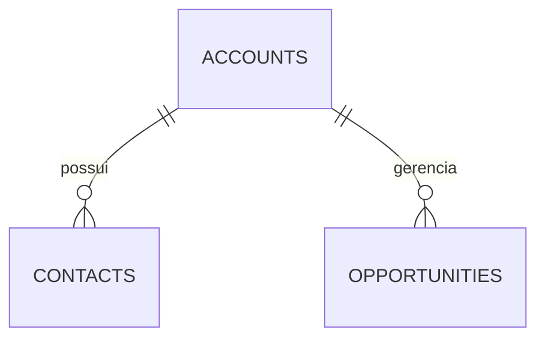

# VLI SF Playground 🚂

CRM de estudos em **português do Brasil**, com interface inspirada no Salesforce Lightning. O app usa **TanStack Start**, React 19, **Tailwind CSS 4**, **Drizzle ORM** e **Turso (libSQL/SQLite)**. As operações de banco são executadas no servidor por server functions.

> A partir de 2026-09-28, este README é o registro de retomada do projeto: cada ajuste deve atualizar o changelog abaixo e a arquitetura/regras quando elas mudarem. O item mais recente fica sempre no topo.

## Changelog

### v2.05.03 — Path e regras de etapa da Oportunidade
- Adiciona Path estilo Salesforce na página individual da oportunidade, logo abaixo do cabeçalho do registro.
- Exibe as etapas Prospecção → Negociação → Aprovação → Formalização → Fechado, campos principais e orientações contextuais.
- Permite concluir Prospecção e avançar para Negociação. A validação no servidor também protege alterações individuais e em lote.
- Bloqueia avanço para Aprovação sem Cotação concluída e sincronizada, para Formalização sem aprovação registrada e para Fechado sem integração NetLex. Esses módulos ainda não existem no playground.
- O Faker de oportunidades começa em Prospecção para respeitar o fluxo implementado.
- Passa a documentar neste README alterações, arquitetura, relacionamentos e regras como registro contínuo do projeto.

### v2.04.03 — Página própria de Oportunidade
- Adiciona a rota de detalhe da oportunidade; clicar no registro abre sua página individual.
- Disponibiliza os dados completos da oportunidade, edição e exclusão, com link para a Conta de gestão.
- Mantém acesso à página a partir da lista de oportunidades e da lista relacionada na Conta.

### v2.03.03 — Objeto Oportunidade
- Adiciona o objeto Oportunidade ligado obrigatoriamente a uma Conta de gestão.
- Inclui instrumento, estágio, segmento, valor, datas previstas e de vigência, percentuais de reajuste, partes contratuais, tarifa de integração e Take or Pay.
- Inclui CRUD individual e em lote, lista relacionada à Conta e total do valor das oportunidades no detalhe da Conta.
- Registra um gerador Faker com seed determinística. O gerador fica pronto para uso; não cria registros automaticamente.

### v2.02.03 — Configurações e personalização de listas
- Adiciona Configurações com opção de apagar os dados do playground e opção de restauração de fábrica dos dados de demonstração.
- Adiciona configuração por objeto para reordenar colunas e escolher quais colunas aparecem.

### v1.02.03 — Identificação de versão
- Exibe a versão atual junto ao nome CRM.
- Define a política de versionamento em [VERSIONING.md](VERSIONING.md).

### Base anterior ao versionamento — Contas, Contatos e listas relacionadas
- Adiciona CRUD individual e em lote, incluindo exclusão individual e em lote, para Contas e Contatos.
- Adiciona páginas próprias para os registros de Conta e Contato.
- Adiciona listas relacionadas configuráveis com criação individual/em lote, vínculo automático ao registro pai, reordenação, remoção e visualização em tela cheia.
- Adiciona geradores Faker em português com seed determinística.
- Estabelece componentes compartilhados para listas, formulários, exclusão e listas relacionadas.

## Objetos e arquitetura

A arquitetura segue o padrão de objetos reutilizáveis do playground. Cada objeto tem sua tabela persistida, lista de registros, rota de detalhe, formulários CRUD e gerador Faker. As relações usam chaves estrangeiras e as listas relacionadas reaproveitam os componentes comuns.



| Objeto | Tabela | Relacionamento | Página de lista | Página do registro |
| --- | --- | --- | --- | --- |
| Conta | `accounts` | Registro pai de Contatos e Oportunidades | `/accounts` | `/accounts/$id` |
| Contato | `contacts` | `account_id` obrigatório → Conta | `/contacts` | `/contacts/$id` |
| Oportunidade | `opportunities` | `account_id` obrigatório → Conta de gestão | `/opportunities` | `/opportunities/$id` |

### Relações e efeitos

- Uma Conta pode ter muitos Contatos e muitas Oportunidades.
- Contato e Oportunidade pertencem a uma Conta por `account_id`; a exclusão da Conta remove seus registros dependentes.
- A lista relacionada respeita o registro pai: ao criar um contato ou oportunidade dentro de uma Conta, o vínculo àquela Conta é aplicado automaticamente.
- A página da Conta agrega o valor das Oportunidades vinculadas. Esse total é uma soma calculada e não substitui o campo próprio `lifetime_value` da Conta.
- Uma Oportunidade aponta para a Conta de gestão, que representa o nível superior. Contas granulares e demais partes contratuais ainda não têm objeto/relacionamento próprio no playground.

### Campos da Oportunidade

| Grupo | Campos |
| --- | --- |
| Contexto | Conta de gestão |
| Comercial | Tipo de instrumento (Contrato, ACS, Aditivo, Outros Serviços), segmento, estágio, valor e data prevista de fechamento |
| Jurídico | Vigência inicial/final, reajustes Diesel/IGP-M/IPCA, contratante(s), entidade VLI contratada, devedor solidário e tarifa de integração |
| Compromisso | Take or Pay |

### Path e validações atuais

Etapas apresentadas no registro: **Prospecção → Negociação → Aprovação → Formalização → Fechado**.

- Toda oportunidade nova começa em **Prospecção**.
- O Path permite avançar de **Prospecção** para **Negociação**.
- A alteração de estágio é validada no servidor para CRUD individual e em lote; não depende apenas do botão ou da interface.
- De **Negociação** para **Aprovação**, o servidor exige que uma Cotação seja concluída e sincronizada. Como Cotação ainda não existe, o avanço permanece bloqueado.
- De **Aprovação** para **Formalização**, exige aprovação registrada. Como o objeto/fluxo de Aprovação ainda não existe, o avanço permanece bloqueado.
- De **Formalização** para **Fechado**, exige a formalização via NetLex. Como a integração ainda não existe, o avanço permanece bloqueado.
- A transição de **Aprovação** para **Negociação** é permitida para representar rejeição ou cancelamento de aprovação.
- A edição de outros campos da oportunidade não exige mudança de estágio.

As regras de negócio completas do processo futuro também devem ser mantidas aqui quando Cotação, Aprovação e integração NetLex forem implementadas. Regras ainda não executadas pelo app devem ser marcadas como pendentes, sem serem descritas como validações ativas.

## Funcionalidades existentes

- CRUD individual em Contas, Contatos e Oportunidades.
- CRUD em lote, incluindo criar, atualizar e excluir registros selecionados (até 500 registros por chamada de servidor).
- Listas relacionadas configuráveis; no detalhe da Conta, Contatos e Oportunidades mostram as primeiras três colunas e suportam operações individuais/em lote.
- Criação em lote numa lista relacionada mantém todos os registros vinculados ao respectivo registro pai.
- Abertura das listas relacionadas em tela cheia, reordenação e remoção da configuração da lista.
- Preferências de visibilidade e ordem das colunas por objeto.
- Configurações globais para limpar dados e restaurar dados de demonstração.
- Faker pt-BR por objeto, com seed determinística; gerar é uma ação explícita do usuário.
- Páginas individuais de registro para todos os objetos atuais.

## Faker e geração de dados

Os geradores vivem em `src/lib/generators/` e são registrados em `src/lib/generators/index.ts`. Cada novo objeto deve registrar um gerador. A seed configurada torna os dados repetíveis, útil para testes e demonstrações. A existência do gerador não insere registros por conta própria. O Faker de Oportunidade cria oportunidades em Prospecção; o vínculo à Conta precisa ser fornecido pelo formulário/usuário.

## Estrutura do código

| Caminho | Responsabilidade |
| --- | --- |
| `src/routes/` | Páginas e rotas de registro (TanStack Router file-based) |
| `src/components/SfListView.tsx` | Listas de objetos e ações sobre registros |
| `src/components/SfRecordDialog.tsx` | Formulários de criação e edição |
| `src/components/SfRelatedLists.tsx` | Listas relacionadas configuráveis |
| `src/components/SfShell.tsx` | Navegação e cabeçalho do CRM |
| `src/lib/crud.ts` | Server functions para leitura, gravação, exclusão e reset |
| `src/lib/schema.ts` | Tabelas, campos e relações Drizzle |
| `src/lib/generators/` | Geradores Faker por objeto |
| `src/lib/version.ts` | Versão exibida no cabeçalho |
| `src/styles.css` | Estilos Salesforce Lightning |
| `VERSIONING.md` | Política e histórico de versões |

## Adicionar um novo objeto

Checklist para manter o app escalável ao incluir objetos:

1. Criar tabela, campos, tipos e relações em `src/lib/schema.ts`; incluir criação compatível no bootstrap idempotente de `src/lib/db.ts`.
2. Registrar a tabela em `TABLES` e garantir regras de exclusão coerentes com suas chaves estrangeiras.
3. Criar o gerador em `src/lib/generators/` e registrá-lo no índice de Faker.
4. Criar a lista do objeto com `SfListView`, ações CRUD e configuração de colunas.
5. Criar uma rota individual `/$id` com leitura, edição e exclusão do registro.
6. Incluir o objeto na navegação e na configuração de listas relacionadas dos objetos pais adequados.
7. Se a lista relacionada criar registros, exigir e aplicar o relacionamento ao registro pai; oferecer os campos de resumo solicitados.
8. Aplicar validações críticas também no servidor, incluindo nos salvamentos em lote.
9. Atualizar este README com os campos, relações, validações e novo item no topo do changelog; atualizar `VERSIONING.md` e `src/lib/version.ts`.
10. Rodar build e revisar o deploy de preview antes da publicação.

## Rodar localmente

```sh
npm install
npm run dev
```

Copie `.env.example` para `.env`. O banco usa Turso/libSQL:

| Variável | Uso |
| --- | --- |
| `TURSO_DATABASE_URL` | URL do banco Turso; vazia usa SQLite local conforme a configuração do app |
| `TURSO_AUTH_TOKEN` | Token de autenticação do Turso |

## Deploy na Vercel

O push/merge em `main` aciona o deploy configurado para o projeto. Para produção e preview, configure no projeto Vercel `TURSO_DATABASE_URL` e `TURSO_AUTH_TOKEN`. O servidor cria/verifica as tabelas necessárias ao iniciar as server functions.

## Ainda não implementado

- Objeto Cotação e sincronização de cotação.
- Objeto/fluxo de Aprovação e alçadas GA/GG/Diretoria.
- Integração com NetLex e transbordo para Contrato.
- Partes contratuais granulares como registros e relacionamentos próprios.
- Campos customizados persistidos criados pela interface. A personalização existente cobre exibição e ordem das colunas.

